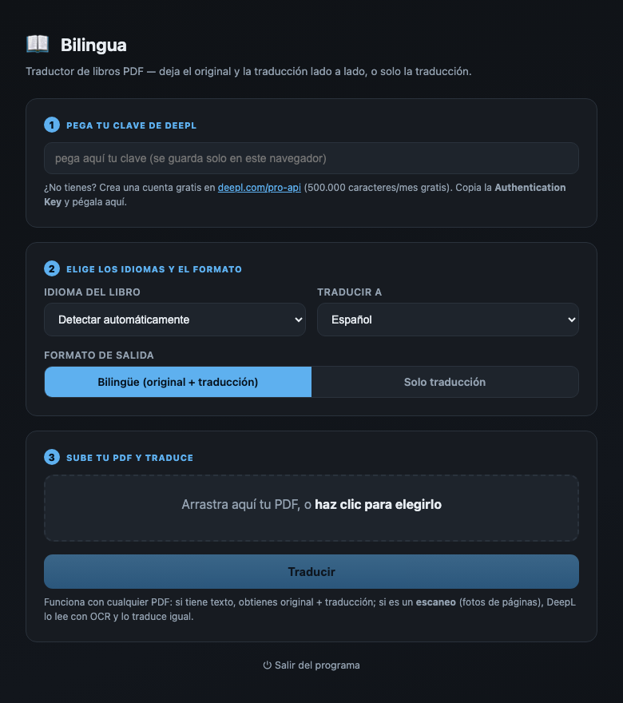

# 📖 Bilingua

Traductor de libros en **PDF** (inglés → español y otros idiomas). Deja el original y la traducción **lado a lado**, o solo la traducción. Funciona también con **PDFs escaneados** (los lee con OCR). No se instala: es un solo archivo que se abre en tu navegador.

## ⬇ Descargar

### 👉 [Descargar para Windows](https://github.com/deltorodurruti/Bilingua/releases/latest/download/Bilingua-Windows.zip)

Descomprime el ZIP (clic derecho → **Extraer todo**) y haz doble clic en `Bilingua.exe`.
Dentro viene una **guía con imágenes** paso a paso.



## Cómo usar (3 pasos)

1. **Doble clic en `Bilingua.exe`.** La primera vez, Windows muestra un aviso azul ("Windows protegió su PC") → haz clic en **"Más información"** → **"Ejecutar de todas formas"**. Es normal y no es un virus: aparece con cualquier programa nuevo que no viene de la tienda.
2. Se abre **tu navegador** con el programa (no hay ventana negra).
3. **Pega tu clave de DeepL**, elige los idiomas, **arrastra tu PDF** y pulsa **Traducir**. Al terminar, descarga el PDF traducido.

La clave se **guarda en tu equipo**: la pegas una sola vez y el programa la recuerda para siempre.

## Necesitas una clave de DeepL (gratis)

Crea una cuenta gratuita en **[deepl.com/pro-api](https://www.deepl.com/pro-api)** (500.000 caracteres al mes sin costo). Copia tu *Authentication Key* y pégala en el programa la primera vez.

## Para desarrolladores

Un solo binario en Go, sin dependencias nativas. Compilar para las tres plataformas:

```bash
./build.sh    # genera dist/Bilingua.exe, Bilingua-mac y Bilingua-linux
```

Motor de traducción: [DeepL API](https://www.deepl.com/pro-api). Interfaz web local servida en `127.0.0.1` (nada sale de tu equipo salvo el texto que se envía a DeepL para traducir).

## Licencia
MIT.
